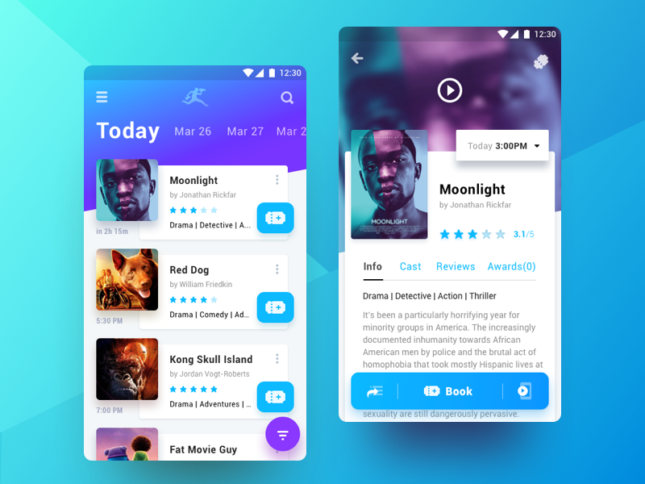

#### The main purpose is using the latest practices and libraries in Jitpack Android.

 

  <i>**UI inspired by </i>

## Architecture

Uses concepts of the notorious Uncle Bob's architecture called [Clean Architecture]. 
The software produced by this architecture is going to be:

* Independent of Frameworks.
* Testable.
* Independent of UI.
* Independent of Database.

### The Dependency Rule

The overriding rule of this architecture says that the source code dependencies always point inwards. 
The outer tiers can only dependent of inner tiers. Therefore, the inner tiers know nothing about the outer tiers. 
The more further you go through the concentric circles, the higher level the software becomes. Which means that the level of abstraction increases.

### Entities

An entity is a set of data structures. These entities are the business objects of the application and encapsulate the most general and high-level rules, such as [Event] or [Rating].

### Use Cases

They are the operations of the application and may contain specific business rules. 
This layer is isolated from database, UI, or any of the common frameworks. 
All use case classes extends [UseCase] abstract class that sets up the schedulers of Reactive Extensions. 

### Adapters

It is a set of adapters that convert data from the format most convenient for the use cases and entities, to the format most convenient for some external agency such as the UI or Database. 
It is this layer that will wholly contain the ViewModels of [MVVM] architectural pattern. 
The models are likely just data structures that are passed from the view to the use cases, and vice versa. 
Similarly, data is converted, in this layer, from the form most convenient for entities and use cases, into the form most convenient for whatever persistence framework is being used.

### Frameworks

The outermost layer is composed of frameworks and tools such as the Database and the Android Framework. 
The Repository pattern is used to encapsulate the details about caching mechanism.

### The Dependency Inversion

In order to not violate the Dependency Rule, the [Dependency Inversion principle] must be used whenever complex data needs to be passed across a boundary to an inward layer. Instead of expecting and directly referencing a low-level component (e.g. as a function parameter), the high-level layer provides and references an interface that must be implemented and inherited from by the caller. This way, the conventional dependency relationship is inverted and the high-level layer is decoupled from the low-level component.

   

### The Dependency Injection

To make the application more testable and avoid having to deal with object instantiations in many points, the [Dependency Injection technique] is used.

> Dependency injection is one form of the broader technique of inversion of control. As with other forms of inversion of control, dependency injection supports the dependency inversion principle.

[Dagger] is the tool used for managing and injection of our dependencies.

### Modules: WIP

   

#### Data

The **LondonTheatreDirect API** groups the data into:

* __System API:__
_Obtain information about enum data types._

Since the data is basically static, a Repository with database caching is used by Gateway.

* __Inventory API:__
_Obtain realtime information about events on sale, venues, prices and availability._

Due the data volatility, it is used a Repository that caches in memory.

   

#### Presentation: WIP

   

## References

* [Android Clean Architecture](https://github.com/android10/Android-CleanArchitecture)
Sample app that is part of a series of blog posts about how to architect an android application using Uncle Bob's clean architecture approach.
* [Android Architecture Blueprints](https://github.com/googlesamples/android-architecture)
Demonstrate possible ways to help with testing, maintaining and extending of an Android app using different architectural concepts and tools.

## Libraries and tools used in the project

### Android

* [Android Support Library](https://developer.android.com/topic/libraries/support-library/index.html)
Provides additional convenience classes and features not available in the standard Framework API for easier development and support across more devices.
* [Data Binding](https://developer.android.com/topic/libraries/data-binding)
Write declarative layouts and minimize the glue code necessary to bind application logic and layouts.
* [Android KTX](https://github.com/android/android-ktx)
A set of Kotlin extensions for Android app development.

### Architecture and Design

* [Android Architecture Components](https://developer.android.com/topic/libraries/architecture/index.html)
A collection of libraries that help you design robust, testable, and maintainable apps.
Start with classes for managing your UI component lifecycle and handling data persistence.
* [Dagger]
A fully static, compile-time dependency injection framework for both Java and Android.

### Reactive

* [RX Java](https://github.com/ReactiveX/RxJava)
A library for composing asynchronous and event-based programs using observable sequences for the Java VM.
* [RX Kotlin](https://github.com/ReactiveX/RxKotlin)
RxJava bindings for Kotlin.
* [RX Android](https://github.com/ReactiveX/RxAndroid)
RxJava bindings for Android.

### View and Image

* [ConstraintLayout](https://developer.android.com/training/constraint-layout/index.html)
Allows you to create large and complex layouts with a flat view hierarchy (no nested view groups).
* [RecyclerView](http://developer.android.com/reference/android/support/v7/widget/RecyclerView.html)
A flexible view for providing a limited window into a large data set.
* [Glide](https://github.com/bumptech/glide)
An image loading and caching library for Android focused on smooth scrolling

### Data Request

* [Retrofit](http://square.github.io/retrofit/)
A type-safe HTTP client for Android and Java.
* [OkHttp](http://square.github.io/okhttp/)
An HTTP & HTTP/2 client for Android and Java applications.
* [Moshi](https://github.com/square/moshi)
A modern JSON library for Android and Java.

### Persistence

* [Room](https://developer.android.com/topic/libraries/architecture/room.html)
The Room persistence library provides an abstraction layer over SQLite to allow fluent database access while harnessing the full power of SQLite.

## TODO

* [Explain more about the architecture diagrams in README file.](https://github.com/andremion/Theatre/issues/2)
* [Improve and add more unit tests](https://github.com/andremion/Theatre/issues/4)
* [Add pagging on event list](https://github.com/andremion/Theatre/issues/5)

## License

    Copyright 2018 Matin Salehi

    Licensed under the Apache License, Version 2.0 (the "License");
    you may not use this file except in compliance with the License.
    You may obtain a copy of the License at

        http://www.apache.org/licenses/LICENSE-2.0

    Unless required by applicable law or agreed to in writing, software
    distributed under the License is distributed on an "AS IS" BASIS,
    WITHOUT WARRANTIES OR CONDITIONS OF ANY KIND, either express or implied.
    See the License for the specific language governing permissions and
    limitations under the License.
